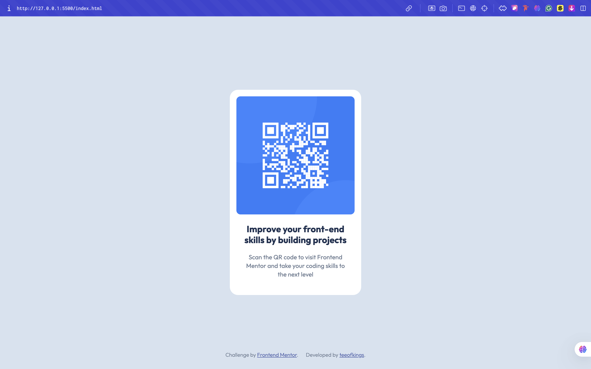

# Frontend Mentor - QR code component solution

This is a solution to the [QR code component challenge on Frontend Mentor](https://www.frontendmentor.io/challenges/qr-code-component-iux_sIO_H). Frontend Mentor challenges help you improve your coding skills by building realistic projects. 

## Table of contents

- [Overview](#overview)
  - [Screenshot](#screenshot)
  - [Links](#links)
- [My process](#my-process)
  - [Built with](#built-with)
  - [What I learned](#what-i-learned)
  - [Continued development](#continued-development)
  - [Useful resources](#useful-resources)
- [Author](#author)
- [Acknowledgments](#acknowledgments)

## Overview

### Screenshot

### Links

- Solution URL: https://www.frontendmentor.io/solutions/qr-code-component-Eple-9EC9H
- Live Site URL: https://qr-code-component-ten-teal-34.vercel.app

## My process

I started by analyzing the design and setting up a simple HTML structure for the QR component. Then, I focused on styling with CSS using Flexbox to perfectly center the container and applying spacing, colors, and typography based on the design. After achieving a clean desktop layout, I added responsive tweaks with media queries to make sure it looked great on mobile too. Finally, I deployed the project on Vercel and polished the README for presentation.

### Built with

- HTML
- CSS

### What I learned

This Project helped me brush up my memory on a lot of stuff i had already forgotten and i hope to grow and improve with enough practice.

### Continued development

I plan to refresh my memory a bit more on HTML & CSS with enough practice as well as double down on JS

### Useful resources

- https://chatgpt.com helped me answer some questions i had
- https://web.dev/learn/html/ assisted in brushing up my memory too

## Author

- Website - Timothy Ezeigbo
- Frontend Mentor - @Teeofkings (https://www.frontendmentor.io/profile/teeofkings)
- Twitter - @teeofkings (https://www.twitter.com/teeofkings)

## Acknowledgments

Thank you FrontEnd Mentor
